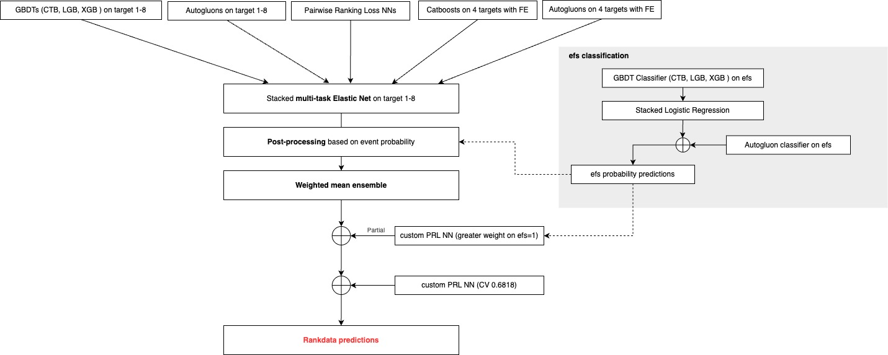

### This Repo is for [Kaggle - CIBMTR - Equity in post-HCT Survival Predictions](https://www.kaggle.com/competitions/equity-post-HCT-survival-predictions)

#### Python Environment

##### 1. Install Packages

```b
pip install --upgrade -r requirements.txt
```

##### 2. Create ``config.yaml`` File

```bash
wandb:
  api_key: "YOUR_WANDB_API_KEY"
huggingface:
  api_key: "YOUR_HUGGINGFACE_API_KEY"
```

#### Prepare Datasets

##### 1. Set Up Kaggle Env

```bash
export KAGGLE_USERNAME="YOUR_KAGGLE_USERNAME"
export KAGGLE_KEY="YOUR_KAGGLE_API_KEY"
```

##### 2. Download Datasets

```bash
sudo apt install unzip
kaggle competitions download -c equity-post-HCT-survival-predictions
unzip equity-post-HCT-survival-predictions.zip
```

#### This Repo

You could try the feature selection and LLM fine-tuning code in this repo.

#### Submissions

The best final submissions are located in the ``submissions`` folder.

#### Conclusion

- The NLP-based method does not work for this competition.
- Feature selection does not work very well, probably because there is a lot of synthetic data in the training dataset.

---------------------------------------------------------------------------------------------------------------------------------------

### 24th Solution: Ensemble and Post-Processing

First, congratulations to the competition winners, and sincere thanks to my team members for their hard work over the past three months, as well as to the competition organizers. Here, I present a summary of our solution (24th place, LB score: 0.694).

We trained regressors and classifiers separately and then integrated their outputs into the ensemble.

#### Solution Overview



#### Individual Model Training

##### Feature Engineering

By training CAT and LGBM, we found that *karnofsky_score* and *comorbidity_score* were always among the top three in feature importance, so we designed the following features in the new feature engineering:

```bash
df["KPS_Bin"] = pd.cut(df["karnofsky_score"], bins=[0, 10, 50, 80, 100], labels=["Critical", "Severely_Dependent", "Partially_Independent", "Healthy"], right=False)
df["Comorbidity_Bin"] = pd.cut(df["comorbidity_score"], bins=[0, 2, 5, np.inf], labels=["Low", "Medium", "High"], right=False)
df["Combined_Bin"] = df["KPS_Bin"].astype(str) + "_" + df["Comorbidity_Bin"].astype(str) 
df["KPS_Minus_Comorbidity"] = df["karnofsky_score"] - df["comorbidity_score"]
df["KPS_Comorbidity_sum"] = df["karnofsky_score"] + df["comorbidity_score"]
df["KPS_Multi_Comorbidity"] = df["karnofsky_score"] * df["comorbidity_score"]
```

Inspired by Chris's idea of joint features, we only searched for combined features of all categorical features due to resource constraints, and one of them proved to be useful.

```bash
df["tbi_status+gvhd_proph"] = df["tbi_status"].astype(str) + '_' + df["gvhd_proph"].astype(str)
```

In addition, we use KMeans to generate clustering features.

```bash
def create_kmeans_features(train, test, n_clusters=8, cat_cols=None, num_cols=None, seed=42):
    if cat_cols is None:
        cal_cols = []
    if num_cols is None:
        num_cols = []
    cols = cat_cols + num_cols    
    train_encoded = pd.get_dummies(train[cols], columns=cat_cols, drop_first=True)
    test_encoded  = pd.get_dummies(test[cols], columns=cat_cols, drop_first=True)
    test_encoded  = test_encoded.reindex(columns=train_encoded.columns, fill_value=0)
    kmeans = KMeans(n_clusters=n_clusters, random_state=seed)
    train_clusters = kmeans.fit_predict(train_encoded)
    train['kmeans_cluster'] = train_clusters
    test_clusters = kmeans.predict(test_encoded)
    test['kmeans_cluster'] = test_clusters
    return train, test
```

Inspired by [this notebook](https://www.kaggle.com/code/ambrosm/esp-eda-which-makes-sense), we observed that the model doesn’t score well for white people. To address this, Octopus210 built features specifically for white people.

```bash
def race_group_white_FE(df, disease_rank_df=None, conditioning_rank_df=None):
    if disease_rank_df is None:
        disease_rank_df = df[df['race_group'] == "White"]['prim_disease_hct'].value_counts().reset_index()
        disease_rank_df.columns = ['prim_disease_hct', 'count']
        disease_rank_df['White_disease_rank'] = disease_rank_df['count'].rank(method='dense', ascending=False).astype(int)

    if conditioning_rank_df is None:
        conditioning_rank_df = df[df['race_group'] == "White"]['conditioning_intensity'].value_counts().reset_index()
        conditioning_rank_df.columns = ['conditioning_intensity', 'count']
        conditioning_rank_df['White_conditioning_rank'] = conditioning_rank_df['count'].rank(method='dense', ascending=False).astype(int)

    df = df.merge(disease_rank_df[['prim_disease_hct', 'White_disease_rank']], on='prim_disease_hct', how='left')
    max_disease_rank = disease_rank_df['White_disease_rank'].max() if not disease_rank_df.empty else 0
    df['White_disease_rank'] = df['White_disease_rank'].fillna(max_disease_rank + 1).astype(int)

    df = df.merge(conditioning_rank_df[['conditioning_intensity', 'White_conditioning_rank']], on='conditioning_intensity', how='left')
    max_conditioning_rank = conditioning_rank_df['White_conditioning_rank'].max() if not conditioning_rank_df.empty else 0
    df['White_conditioning_rank'] = df['White_conditioning_rank'].fillna(max_conditioning_rank + 1).astype(int)

    df['comorbidity_score*WDR'] = df['comorbidity_score'] * df['White_disease_rank']
    df['karnofsky_score/WDR'] = df['karnofsky_score'] / df['White_disease_rank']
    df['donor_age*WDR'] = df['donor_age'] * df['White_disease_rank']
    
    df['comorbidity_score*WCR'] = df['comorbidity_score'] * df['White_conditioning_rank']
    df['karnofsky_score/WCR'] = df['karnofsky_score'] / df['White_conditioning_rank']
    df['donor_age*WCR'] = df['donor_age'] * df['White_conditioning_rank']

    return df, disease_rank_df, conditioning_rank_df
```

We also created ranking factors for the following features: *donor_age*, *age_at_hct*, *prim_disease_hct*, and *year_hct*, and built TF-IDF features for *conditioning_intensity*, *dri_score*, and *sex_match* in the categorical features.

Next, we checked the feature importance and selected *tfidf_conditioning_intensity_5*, *tfidf_conditioning_intensity_14*, *tfidf_dri_score_9*, *tfidf_dri_score_10*, and *tfidf_sex_match_1*, as TF-IDF ranked high in feature importance.

Finally, we mapped all categorical features into one-hot encoding, achieving a single CAT model score of LB = 0.688.

#### Regressors

- **GBDTs (CAT, LGB, XGB) for 8 targets:**

	Inspired by public kernels, these models were trained with some feature engineering (FE).

- **AutoML models for 8 targets:**

	We used AutoGluon with some feature engineering as well.

- **CatBoost models for 4 targets with extensive feature engineering:**

	These models were tuned for both CV and LB performance.

- **AutoML models for 4 targets with extensive feature engineering:**

	We also used AutoGluon, similar to the approach above.

- **Pairwise Rankloss NN (PRL NN):** 

  (1) Public models with some feature engineering.

  (2) Modified versions that emphasize data pairs with `efs=1` and assign more weight to pairs corresponding to races with poor performance (e.g., white).

#### Classifiers

- **GBDTs (CAT, LGB, XGB)**
- **AutoML (AutoGluon)**

#### Stacking with Meta-Model

We consolidated the outputs of our regressors and classifiers separately using stacking techniques:

- **For Regressors:**

	A multi-task Elastic Net was used as a meta-model for the 8 targets. Its inputs were the standardized outputs from the individual models, excluding the custom PRL NNs, as these were used at the final stage.

- **For Classifiers:**

	GBDT predictions were stacked using Logistic Regression and then combined with AutoGluon’s predictions through a weighted average.

#### Post-Processing

To refine the Elastic Net outputs, we applied post-processing adjustments based on the classifier’s probability predictions. Specifically, prediction values with a high probability of `efs=0` were decreased. The following code snippet illustrates the adjustment:

```ba
for col in target_columns:
    def apply_adjustment(row):
        race = row['race_group']
        params = best_params[col][race]
        alpha = params["alpha"]
        beta  = params["beta"]
        theta = params["theta"]
        gamma = params["gamma"]
        return row[col] - np.clip(alpha * (beta - row['cls']), 0, None) - np.clip(theta * (gamma - row['cls']), 0, None)
    df_elastic_net_oof[col] = df_elastic_net_oof.apply(apply_adjustment, axis=1)
```

The parameters (*alpha*, *beta*, *theta*, and *gamma*) were optimized race-by-race using Optuna. Our objective function was designed to maximize the average evaluation over multiple random subsamples to mitigate overfitting.

After post-processing, we performed a weighted mean ensemble of the 8 target outputs into a single unified prediction.

#### Integration of Custom PRL NN

After that, we integrated a custom PRL NN — with a loss function that strongly emphasizes `efs=1` — with a small weight. This integration was applied only to data where the `efs` probability exceeded the race-specific threshold for the maximum F1 score.

Additionally, to further boost our CV score, we blended in predictions from another custom PRL NN (which achieved a CV score of 0.682). This model was particularly effective for weaker races, giving them more weight.

#### What Didn't Work?

- Fine-tune language models

	We fine-tuned both the DeBERTa-v3 and Gemma models according to the specific input format of the tabular information (converted into string inputs) for both 10-fold classification and regression tasks, relying solely on either `efs` or target transformation results for the last two columns. However, these models did not perform well.

#### Submission Strategy

Our final submission was determined by selecting the best CV and the best LB:

- **Best CV:** CV 0.6908 / Public LB 0.690
- **Best LB:** CV 0.6853 / Public LB 0.694

The best CV solution is the one described above. The best public LB solution was an ensemble that used fewer models and a more naive, manually clipped post-processing approach.

#### "Trust CV"

The Private LB scores were:

- **Best CV**: 0.694
- **Best LB**: 0.690

This result validates the effectiveness of our “Trust CV” strategy. Although we experienced some anxiety due to declining LB scores during the final stages of the competition, trusting CV ultimately guided us to win silver.